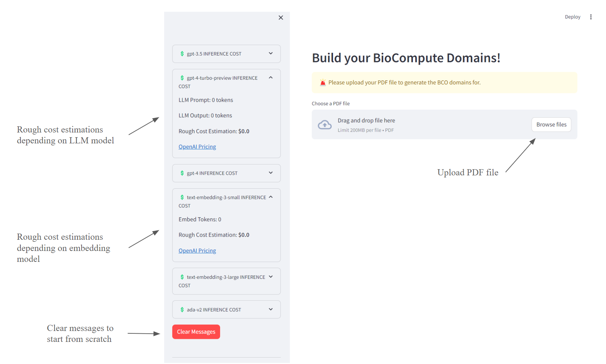
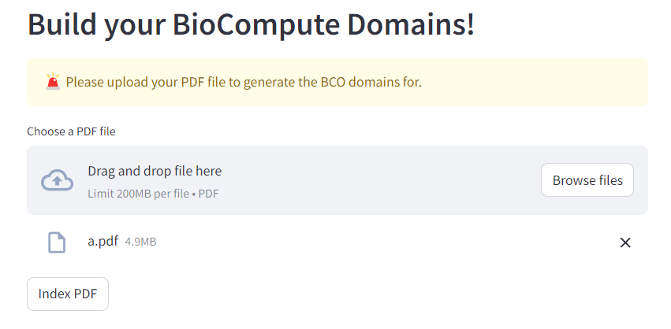
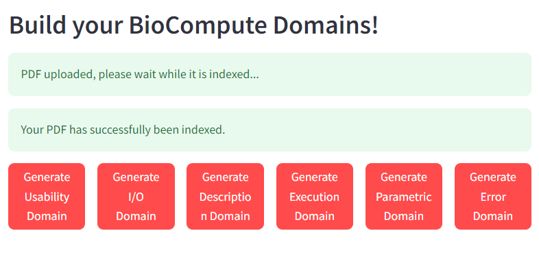

# BCO LLM Proof of Concept

**NOTE:** Work on this has moved to [here](https://github.com/biocompute-objects/biocompute-object-llm). This repository will no longer be updated. 

- [Approach Justification and Background](#approach-justification-and-background)
- [Contraints](#contraints)
- [Tech Stack](#tech-stack)
    - [LlamaIndex](#llamaindex)
    - [Streamlit](#streamlit)
- [Overview and Usage](#overview-and-usage)

---

## Approach Justification and Background 

The Biocompute Object (BCO) LLM will assist users in automatically creating specific BCO domains from papers. This proof of concept uses a **retrieval augmented generatation** (RAG) approach rather than a standalone LLM or fine tuned LLM approach. A traditional standalone LLM suffers from multiple drawbacks in this problem context. Recent studies ([Lost in the Middle](https://cs.stanford.edu/~nfliu/papers/lost-in-the-middle.arxiv2023.pdf)) have shown that LLM's struggle with long contexts:

> ... performance can degrade significantly when
> changing the position of relevant information, indicating that current language models
> do not robustly make use of information in long input contexts. 

LLMs also are known to extrapolate when the facts aren't available, resulting in confident, but false output. These two issues are especially present with our specific goal: uploading potentially multi-page papers to be ingested by the LLM, and then asking for the LLM to extract specific information relating to the purpose and schema of a specific BCO domain. 

Retrieval augmented generation can help to address both of these issues. By allowing us to intelligently chunk embed the PDF information, we can utilize intelligent retrieval to only obtain the relevant information the LLM needs for the specific domain. By sending more focused prompts, we hypothesize better performance and more specific responses.  

## Contraints

1. Users have to have a PDF of the paper they want to build a BCO for. 
    - Many websites, including PubMed Central, have specific settings to prevent automated systems and bots from scraping or reading from their website. 
2. Users will have to get each domain separately. 
    - This will allow for more focused responses, which is beneficial for a couple reasons. 
        - Some papers will not have direct mappings to the information required for the specifically requested domain. The more specific inquiries allow the LLM to provide more context to the user that the JSON provided might not be complete and/or that the user might have to manually edit or decide on whether the answer is acceptable or not. 
        - A per-domain approach is more engaging for the user, and they are more likely to check and make sure each step provides good data instead of the LLM returning a large JSON response (that is highly likely to have mistakes in schema compliance, content, etc.) that the user is more likely to skim or accept without parsing the entire thing. 
3. Even though a LLM is used as the core engine, the user cannot free text chat with the model. Because the domain of each problem is a constrained, specific problem, we can achieve more consistent results with standardized under the hood prompts to the LLM.
    - The user will interact with buttons that they can press for each domain generation. 

## Tech Stack 

### LlamaIndex

At the core of this proof of concept is the [LlamaIndex](https://github.com/run-llama/llama_index) library. LlamaIndex is a data framework designed for LLM based applications. It helps to ingest, structure, and access private or domain-specific data. LlamaIndex does a lot of the heavy lifting in solving our core issues raised above. Additionally, LlamaIndex provides a great deal of flexibility and abstraction depending on how custom you want your RAG pipeline to be. Right now, we are using LlamaIndex as is, essentially just out of the box. Even with an almost purely stock configuration, we are still getting impressive results, making it even more promising for when we hone and configure it further. 

LlamaIndex has a few key concepts/tools that each have a variety of levels of customization depending on how finely tuned you want your RAG pipeline to be for your application.  

First is the data loader (or reader), LlamaIndex offers some standard readers out of the box but where LlamaIndex really shines is its huge open source collection of community created data loaders at [LlamaHub](https://llamahub.ai/?tab=readers). Data loaders handle the data ingestion and formatting into Document objects and the subsequent Nodes. Documents and Nodes are key abstractions in LlamaIndex. At a high level, a Document is a generic container for any data source. By default, Documents store the text (and/or images) from the data source, a dictionary of annotations containing the metadata, and a dictionary of relationships to the other Documents/Nodes. At a high level, a Node represents a "chunk" of a source Document. The creation of Nodes is where the custom data loaders can offer big performance improvements. The way the source data is chunked and split prior to the indexing process can have a large effect on the performance of the application in terms of both accuracy and relevance of the results returned. 

The next concept is the indexing process. The most important part of the indexing process is the embedding step. During this step, the text of each Node is turned into a vector embedding. This step converts the semantics or meaning of your text into a numerical representation. This is what allows for semantic search, allowing the system to locate text that is related to the meaning of the query terms rather than just matching words.

After embedding has been completed, engines are used to access the emdbedded vectors.

These concepts form the high level abstraction that LlamaIndex provides for building powerful RAG applications.

### Streamlit

To quickly spin up a debugging/prototyping front end interface, streamlit was used. Streamlit is an open-source Python library that siplifies the process of creating and sharing web apps for machine learning and data science. The main reason for using streamlit was the simplicity and the ability for rapid prototyping. By only needing pure Python, there is no need to work with other dependencies and languages. A proper Typescript front end is definitely more production ready, but streamlit for quick prototyping was ideal to reduce development overhead. 

## Overview and Usage 

The application is written in a way that you should be able to easily switch out both the embedding and LLM models if you would prefer to use locally hosted models for cost or other reasons. However, the default configuration uses the OpenAI `text-embedding-3-small` embedding model and the `gpt-4-0125-preview` LLM model.

To start the application, you'll have to create your `.env` file and save your OpenAI API key (if you are using a locally hosted or different API model for embedding and the LLM this step can be skipped or changed as needed). For example: 

```.env
OPENAI_API_KEY=<KEY>
```

The application automatically stores the PDF file you upload locally in your project. Make sure you have a `data/` directory within your project's root. 

Next, you can start the streamlit application (from within the project's root directory) using: 

```bash
streamlit run main.py
```

The load up UI will look like this: 



Note that the cost estimators will default to be collapsed except for the specific models you are using. You can still expand the collapsed cost estimators but the estimations will likely be a little off. Each model uses a different tokenizer, and depending on the embedding models used the cost estimation formula's can differ. However, these should still give you a solid estimation of the cost for different actions. 

After you choose a PDF file to upload, you should press the `Index PDF` button as shown below. This button will kick off the indexing and embedding of your uploaded file. 



Once your PDF is properly indexed, you will see the interaction buttons where you can start generating your BioCompute Objects domains! 


